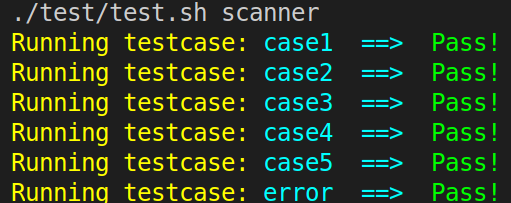

# Project Assignment 1 - Lexical Definition

**Introduction to Compiler Design by Prof. Yi-Ping You**

Due Date: **23:59, October 16, 2019**

Your assignment is to write a scanner for the **`P`** language in `lex`. This document gives the lexical definition of the language, while the syntactic and semantic definitions and code generation will follow in subsequent assignments.

Your programming assignments are based around this division and later assignments will use the parts of the system you have built in the earlier assignments; that is, in the first assignment you will implement the scanner using `lex`, in the second assignment you will implement the syntactic definition in `yacc`, in the third and fourth assignments you will implement the semantic definition, and in the last assignment you will generate RISC-V assembly code by augmenting your yacc parser.

This definition is subject to modification as the semester progresses. You should take care in implementation that the programs you write are well-structured and easily changed.

---

**Table of Contents**
- [Project Assignment 1 - Lexical Definition](#project-assignment-1---lexical-definition)
  - [1. Character Set](#1-character-set)
  - [2. Lexical Definition](#2-lexical-definition)
    - [Tokens That Will Be Passed to the Parser](#tokens-that-will-be-passed-to-the-parser)
    - [Tokens That Will Be Discarded](#tokens-that-will-be-discarded)
  - [3. Implementation Hints](#3-implementation-hints)
  - [4. What Should Your Scanner Do](#4-what-should-your-scanner-do)
  - [5. Project Structure](#5-project-structure)
  - [6. Build and Execute](#6-build-and-execute)
  - [7. Submitting the Assignment](#7-submitting-the-assignment)
  
---

## 1. Character Set

**`P`** programs are formed from ASCII characters. Control characters are not used in the language's definition except **`\n`** (line feed) and **`\t`** (horizontal tab).

## 2. Lexical Definition

Tokens are divided into two classes: tokens that will be passed to the parser and tokens that will be discarded by the scanner (i.e. recognized but not passed to the parser).

### Tokens That Will Be Passed to the Parser

The following tokens will be recognized by the scanner and will be eventually passed to the parser:

+ **Delimiters**

  Each of these delimiters should be passed back to the parser as a token.

  ||Delimiter|
  |:-:|:-:|
  |comma|**`,`**|
  |semicolon|**`;`**|
  |colon|**`:`**|
  |parentheses| **`(`**, **`)`**|
  |square brackets| **`[`**, **`]`**|

+ **Arithmetic, Relational, and Logical Operators**

  Each of these operators should be passed back to the parser as a token.

  ||Operator|
  |:-:|:-:|
  |addition|**`+`**|
  |subtraction|**`-`**|
  |multiplication|**`*`**|
  |division| **`/`**, **`mod`**|
  |assignment|**`:=`**|
  |relational| **`<`**, **`<=`**, **`<>`**, **`>=`**, **`>`**, **`=`** |
  |logical|**`and`**, **`or`**, **`not`**|

+ **Keywords**

  The following keywords are reserved words of **`P`** (Note that the case is significant):

  + **`array`**, **`begin`**, **`boolean`**, **`def`**, **`do`**, **`else`**, **`end`**, **`false`**, **`for`**, **`integer`**, **`if`**, **`of`**, **`print`**, **`read`**, **`real`**, **`string`**, **`then`**, **`to`**, **`true`**, **`return`**, **`var`**, **`while`**

  Each of these keywords should be passed back to the parser as a token.

+ **Identifiers**

  An identifier is a string of letters and digits beginning with a letter. Case of letters is relevant, i.e. **ident**, **Ident**, and **IDENT** are different identifiers. Note that keywords are not identifiers.

+ **Integer Constants**

  A sequence of one or more digits. An integer that begins with 0 and followed by other digits is assumed to be **octal**; otherwise, it is assumed to be **decimal**.

+ **Floating-Point Constants**

  Two sequences of one or more digits concatenated with a dot **`.`** symbol separating the integral part from the fractional part. There should not be any redundant **`0`** in the two parts.

  > Note that `009.1` is a valid input in **`P`** (whether `009.1` is a valid syntax should not be the lexer's concern) because the input would be recognized as two seperate tokens: `00` (an octal integer constant) and `9.1` (a floating-point constant).

  > Moreover, `0.0` is a valid floating-point constant because there are no redundant `0`s in both side of the dot symbol.

+ **Scientific Notations**

  A way of writing numbers that accommodates values too large or small to be conveniently written in standard decimal notation. All numbers are written like **`aEb`** or **`aeb`** (**`a`** times ten to the power of **`b`**), where the exponent **`b`** is a **decimal integer** (see `Integer Constants` above ) with the optional sign and the coefficient **`a`** is any real number, called the significand, a decimal integer or floating-point number.

  For example: `1.23E4`, `1.23E+4`, `1.23E-4`, `123E4`, etc.

+ **String Constants**

  A string constant is a sequence of zero or more ASCII characters appearing between double-quote (`"`) delimiters. String constants should not contain embedded newlines. A double-quote appearing with a string must be written twice. For example, `"aa""bb"` denotes
  the string constant `aa"bb`.

### Tokens That Will Be Discarded

The following tokens will be recognized by the scanner, but should be discarded rather than passing back to the parser.

+ **Whitespace**

  A sequence of blanks (spaces) tabs, and newlines.

+ **Comments**

  Comments can be denoted in two ways:

  + *C-style* is text surrounded by **`/*`** , and **`*/`** delimiters, which may span more than one line;

    Noted that C-style comments **don't "nest"**. Namely, **`/*`** always closes with the first **`*/`**.
  + *C++-style* is text following a **`//`** delimiter running up to the end of the line.

  Whichever comment style is encountered first remains in effect until the appropriate comment close is encountered. For example

      // this is a comment // line  */ /* with some /* delimiters */  before the end

      /* this is a comment // line with some /* and	\\
      // delimiters */

  are both valid comments.

+ **Pseudocomments**

  A special form of  *C++-style* comments, called  **`pseudocomments`**, are used to signal options to the scanner.
  Each **`pseudocomment`** consists of a *C++-style* comment delimiter, a character **`&`**, an upper-case letter, and either a  **`+`** or **`-`** (**`+`** turns the option "on" and **`-`** turns the option "off" ). In other words, each **`pseudocomment`** either has the form `//&C+` or the form `//&C-` where `C` denotes the option.

  There may be up to 26 different options (A-Z). Specific options will be defined in the project description. A comment that does not match the option pattern exactly has no effect on the option settings.  Undefined options have no special meaning, i.e. such **`pseudocomments`** are treated as regular comments.

  For this project, define two options, **`S`** and **`T`**. **`S`** turns **source program listing** on or off, and **`T`** turns **token listing** on or off. The effect of options starts from current line of code. By default, both options are on. For example, the following comments are **`pseudocomments`** :
  + `//&S+`
  + `//&S-`
  + `//&S+&S-`  _**This leaves the `S` option on because the rest of the comment is ignored**_

## 3. Implementation Hints


+ **Token listing**

  There are four C macro definitions in the starter code `src/lex.l`: **`token`**,　**`tokenChar`**, **`tokenInteger`**, and **`tokenString`**. You **should** write your scanner actions using the aforementioned macros or any other ones you defined in this manner for implementing the **`token listing`** option.

  You may notice that the `#` operator is used in the macro definitions. Let's take the macro  `token(t)` for example:
  ```c
  //lex.l
  #define token(t) {LIST; if (Opt_T) printf("<%s>\n", #t);}
  ```
  Actually, `#` is a C preprocessor operator, called **Stringizing operator**. Below are some refenreces for you:
    + [**The C Preprocessor** by Alex Allian](https://www.cprogramming.com/tutorial/cpreprocessor.html) (see **String-izing Tokens**)
    + [**Stringizing operator (#)** - C/C++ preprocessor operator for Visual Studio 2019 in MS docs ](https://docs.microsoft.com/zh-tw/cpp/preprocessor/stringizing-operator-hash?view=vs-2019)

  Here we provide some meanings/usages of these macros:
  + The macro **`tokenInteger`** is used for tokens that return an integer value as well as a token (e.g., integer constants)
  + The macro **`tokenChar`** is used for tokens that return a character as well as a token.
  + The macro **`tokenString`** is used for tokens that return a string as well as a token.
  + The macro **`token`** is used for all other tokens.

  The first argument of all four macros is a string. This string names the token that will be passed to the parser.  The macro **`tokenInteger`** takes a second argument, which must be an integer and **`tokenString`** takes a second argument, which must be a string. Some examples are given below:

  |Token|Lexeme| Macro Call|
  |:-:|:-:|:-|
  |left parenthesis | ( | `tokenChar('(');` |
  |begin| begin| `token(KWbegin);`|
  |identifier|ab123| `tokenString(id,"ab123"); tokenString(id, yytext);`|
  |integer constant |23| `tokenInteger(integer,23)`|
  |boolean constant| true| `token(KWtrue);`|


## 4. What Should Your Scanner Do

Your goal is to have your scanner print tokens and lines, based on **`S`**(source program listing), **`T`**(token listing) options.

+ If **`S`** (listing option) is on, each line should be listed, along with a line number.
+ If **`T`** (token option) is on, each token should be printed on a separate line, surrounded by angle brackets.

For example, given the input:

```pascal
// print hello world
begin
var a : integer;
var b : real;
print "hello world";
a := 1+1;
b := 1.23;
if a > 01 then
b := b*1.23e-1;
//&S-
a := 1;
//&S+
//&T-
a := 2;
//&T+
end if
end
```

Your scanner should output:

```pascal
1: // print hello world
<KWbegin>
2: begin
<KWvar>
<id: a>
<:>
<KWinteger>
<;>
3: var a : integer;
<KWvar>
<id: b>
<:>
<KWreal>
<;>
4: var b : real;
<KWprint>
<string: hello world>
<;>
5: print "hello world";
<id: a>
<:=>
<integer: 1>
<+>
<integer: 1>
<;>
6: a := 1+1;
<id: b>
<:=>
<float: 1.23>
<;>
7: b := 1.23;
<KWif>
<id: a>
<>>
<oct_integer: 01>
<KWthen>
8: if a > 01 then
<id: b>
<:=>
<id: b>
<*>
<scientific: 1.23e-1>
<;>
9: b := b*1.23e-1;
<id: a>
<:=>
<integer: 1>
<;>
12: //&S+
13: //&T-
14: a := 2;
15: //&T+
<KWend>
<KWif>
16: end if
<KWend>
17: end
```

+ **Error Handling**

  If no rule matches the input pattern, print the line number and the first character and then abort the program. The output should be the following format which will be covered in template.

> `error at line 3: bad character "$"`

## 5. Project Structure

+ README.md
+ /src
  + Makefile
  + **`lex.l`**
+ /report
  + **`READMD.md`**

In this project, you have to finish `src/lex.l` and write your report in `report/READMD.md`.
The report should at least describe the abilities of your scanner.

If you want to preview your report in GitHub style markdown before pushing to GitHub, [grip](https://github.com/joeyespo/grip) might be the tool you need.

## 6. Build and Execute

+ Build: `cd src && make`
+ Execute: `./scanner [input file]`
+ Test: `make test`

**Build project**

TA would use `src/Makefile` to build your project by simply typing `make clean && make`. You don't need to modify this file, but if you do, it is **your responsibility** to make sure this makefile have at least the same make targets we provided to you.

**Test your scanner**

We provide some basic tests in the `src/test` folder. Simply `cd` to `src` folder and type `make test` to build and test your scanner.

The objective we provide sample test cases is making sure your scanner outputs in correct format and scans basic tokens correctly. Make sure you pass all test cases in order to receive your grade.

> **Disclaimer**: To receive full grade in this assignment, passing sample test cases is necessary but not sufficient. You should create more test cases in order to make sure your scanner handles all `Lexical Definition` in this assignment correctly.

If you pass all test cases, you will get:



You will get following output messages if your scanner outputs wrong format ( Red one is sample solution and green one is your output ):


## 7. Submitting the Assignment

You should push all your commits to the designated repository (hw1-\<Name of your GitHub account\>) under the compiler-f19 GitHub organization by the deadline (given in the very beginning of this assignment description). At any point, you may save your work and push the repository. We will grade the last push before the deadline.

Note that the penalty for late homework is **15% per day** (weekends count as 1 day). Late homework will not be accepted after sample codes have been posted.

In addition, homework assignments **must be individual work**. If I detect what I consider to be intentional plagiarism in any assignment, the assignment will receive reduced or, usually, **zero credit**.
