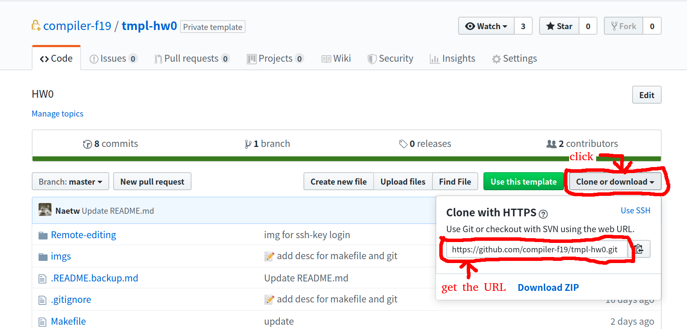

# HW0 環境熟悉

+ Name: <請修改 Makefile>
+ ID: <請修改 Makefile>
+ GitHub: <請修改 Makefile>
+ Email: <請修改 Makefile>

Last Make: <自動生成的欄位喇>

---

> 這學期所有作業都會在資工系的 Linux 工作站中進行批改並評分，無論同學使用何種環境進行開發，**務必確保**自己的作業能夠在 Linux工作站中**用我們指定的方式**成功編譯。

這次程式作業有三個目的

1. 確保你的環境正確，能用在以後的作業
2. 能使用 GNU Make
3. 可以使用 Git 來管理專案並繳交作業

## Step0. 進入工作站並且複製一份你的 HW0 Repository

> 這份教學的預設環境是在系上的 Linux 工作站執行。
>
> 在這步驟完成前，請確認自己已經有工作站帳號。

進入工作站的方法請參考[交大系計中教學](https://cscc.cs.nctu.edu.tw/workstation-guide)，若想要使用潮潮的 VSCode 請參閱[這裏](./Remote-editing)。

進入你的 Repo 中找到要複製 Repo需要的網址，如下圖所示



在工作站中下指令：
```Shell
git clone 剛剛得到的 Repo 網址
```

完成後你就會在工作站上看到一份你的 HW0 的資料夾，接著進入該資料夾繼續完成下列步驟。

## Step1. 填入正確資訊並使用 Makefile

**GNU Make**

在編譯器設計這堂課中，不會直接寫編譯器的原始碼，而是利用工具來幫助撰寫編譯器的功能，工具會產生你撰寫的編譯器的 C 語言程式碼，最後再利用 GNU Make 來建構整支編譯器程式。

在專案中通常會處理多個原始碼，而檔案間也會有不同的相依性，我們會利用 `GNU Make`( 簡稱 Make ) ，一支自動化管理原始碼相依性的程式來輔助開發。Make 的運作方法很簡單，只要在專案目錄下用終端機執行 `make <target>` 類型指令，Make 就會自動尋找檔案名稱為  Makefile 或 makefile 的文字檔（沒有副檔名），依照其內容執行 `<target>` 對應的指令。

更多有關 Make 的內容，可以參考 [官方文件](https://www.gnu.org/software/make/manual/make.html) 或是由阮一峰撰寫的 [Make 命令教學](http://www.ruanyifeng.com/blog/2015/02/make.html)，建議在撰寫後續作業時可以邊學邊做。

### 修改 Makefile 產生正確 README.md 文件

**什麼是 README.md ?**

每個工具或是專案都會有他的使用說明書，當在 GitHub 中瀏覽某個專案目錄，或某個資料夾內時，網站會預設讀取並顯示該資料夾下的 README.md 檔案，副檔名 `md` 代表這個文字檔內的寫作格式屬於 Markdown。Markdown 是一種語法相對簡單，被大量使用的標記式語言，幾乎所有線上的編輯器都會努力支援 J 個東西，這次的 HW0 說明文件、以及這學期的課程網站都是使用 Markdown 撰寫，值得各位花時間認識一下。

推薦各位可以直接上 [HackMD](https://hackmd.io/) 練習 Markdown，裡面也有一些簡單的[教學](https://hackmd.io/getting-started)。HackMD 是誕生於台灣北科大的新創公司，因此相較其他線上的編輯器有更好的中文的支援度。

**動動手**

在這次作業中你必須透過修改 Makefile 檔案，將其資料修改成正確的個人資訊並呼叫 `GNU Make` 來更新專案目錄下 README.md 的內容。別擔心，每位同學的作業專案 (Repository) 只有自己跟助教能夠存取。

打開 `Makefile` 檔案, 分別要修改的變數的定義是:

- studentName : 你的中文姓名
- studentId : 你交大的學號
- studentGitHubHandle : 你的 GitHub 帳號
- studentEmail : 你在 GitHub 使用的主要電子信箱

##### 更新後的 Makefile 內容範例：
```Shell
// Makefile
studentName = 編義氣
studentId = 0612999
studentGitHubHandle = nctuGreatAgain
studentEmail = nctuGreatAgain@gmail.com
```
在 Makefile 填入正確資訊後，請退出回到專案主目錄下，直接下指令 `make`。

在這之後會看到類似下列的訊息，主要依據 Makefile 中的內容更新 README.md 資訊。
```Shell
$ make
cp .README.backup.md README.md
# Update README.md ...
sed -i.sedbak 's/Name :.*/Name: 編義氣/'  README.md
sed -i.sedbak 's/ID :.*/ID: 0612999/'  README.md
sed -i.sedbak 's/GitHub :.*/GitHub: nctuGreatAgain/'  README.md
sed -i.sedbak 's/Email :.*/Email: nctuGreatAgain@gmail.com/'  README.md
sed -i.sedbak 's/Last Make :.*/Last Make: Wed Aug 21 13:05:25 CST 2019/'  README.md
cat README.md | head -n 10
# HW0 環境熟悉

+ Name : 編義氣
+ ID : 0612999
+ GitHub : nctuGreatAgain
+ Email : nctuGreatAgain@gmail.com

Last Make: Wed Aug 21 13:05:25 CST 2019

---
```
可以檢查一下你的 README.md 是否有正確更新成你的個人資訊。


使用 Make 的好處是新的使用者不太花費精神理解整個專案的建置邏輯。不知道怎麼辦？ `make` 一下就不是問題，最多只要閱讀 Makefile 中寫好的規則，就能夠快速建立起整個專案。**往後的作業也都會使用 Make 來編譯各位的專案**。

## Step2. 使用 Git 繳交作業到 GitHub

**Git**

撰寫專案時，你可能每天都會修改一些原始碼，完成一些新功能。不過有些時候總會需要進行一些難以回復的大改動，為求保險你可能會想要事先保存改動前的程式碼，確保改壞之後還能重新開始，這就是版本控管的概念。但在這種時候你會怎麼做？最簡單的方法是在改動前先複製一份原始碼並壓縮成一個檔案保存下來。這方法簡單又暴力，甚至某些中小企業仍在專案中將這種管理方式奉為圭臬。但這種保存程式碼狀態的方法會遇到幾個狀況來困擾你，第一種狀況是 —— 隨著專案的發展，開發者必須手動管理一大堆狀態，光是為狀態命名就是一件難事，但更恐怖的情況可能是，開發一個月後你甚至沒辦法回想在不同時期保存下來的 100 個壓縮檔分別代表什麼樣的專案狀態，隨便例子:`project_final-fianl_v99.zip`。第二種狀況是，你想做出某個功能，但卻需要用到兩個過去寫過，分屬於不同版本的程式碼，為了確保新的程式能動，必須打開兩個版本的專案，手動比較差異來確保新的程式碼是可以動的。這種情況多做幾遍後你就會發現自己將太多時間花費在雜事上面，非常干擾工作流程，最後導致你時間不夠、難以專心，變的一事無成，就如同正在寫這篇文件的助教的人生一樣 QQ。

人生很難，沒必再讓他更難下去，版本控管工具正躺在一旁，準備解救你的悲哀人生。


Git 最初是為了管理 Linux 核心開發而誕生出的版本控管工具，在它的概念中，所有要被管理的狀態都會被紀錄成一個個提交紀錄 ( Commit )，開發期間只需要不停的紀錄哪些新改動要被放到新版本之中，並且透過指令提交，將狀態寫入歷史可以。Git 會幫你管理不同的版本，比較不同版本間的狀態差異，必且讓開發者能夠快速將專案跳回特定 Commit 時的狀態。

這裡詳細的使用介紹，請直接參照官方文件或是由高見龍寫的 [為你自己學 Git](https://gitbook.tw/chapters/using-git/init-repository.html)。


### 設定 Git / GitHub Account 連結

> 註：這個有沒有設定並不會影響作業繳交，但助教還是建議設定一下。

GitHub 是透過 email 信箱來認人的，若沒有設定 email，GitHub 就無法把你做的提交記錄 (commit) 關聯到你的帳號，也就會讓你的提交記錄在 GitHub 上變得醜醜的（原因請參考 [Why are my commits linked to the wrong user](https://help.github.com/en/articles/why-are-my-commits-linked-to-the-wrong-user)）：


若想要讓 GitHub 知道這個提交記錄是誰做的，就得設定好自己的 email（實際上單單設定 email 還是無法確認到底是誰做的 XD 可見 [git-blame-someone-else](https://github.com/jayphelps/git-blame-someone-else)）：

一樣在工作站上（當前目錄應該是這份作業）下以下指令（**email 請改成你自己的**）：

```Shell
git config --global user.email "email@example.com"
```

接著確認是不是把 email 正確地設定好了：

```Shell
git config --global user.email
email@example.com
```

最後則是在 GitHub 帳號資訊中加入你剛剛填入的 email 信箱，可見 [Setting your commit email address on GitHub](https://help.github.com/en/articles/setting-your-commit-email-address#setting-your-commit-email-address-on-github)。

如此一來，往後透過工作站進行的提交記錄都會使用上面填好的 email 資訊。（若想做更多的事情可以參考 [Setting your commit email address](https://help.github.com/en/articles/setting-your-commit-email-address)）


### 繳交作業

當你看到這裏時，比起最開始收到作業時的模樣，這個專案的 `Makefile` 以及 `README.md` 已經被你改動過了。接下來要將這些改動過的程式碼加入到新版本之中，納入 Git 的控管範圍內，從此成為歷史文件，跟中英聯合聲明一樣。

首先使用 `git status` 看一下當前狀態

```Shell
$ git status

On branch master
Your branch is up to date with 'origin/master'.

Changes not staged for commit:
    (use "git add <file>..." to update what will be committed)
    (use "git checkout -- <file>..." to discard changes in working directory)

    modified:   Makefile
    modified:   README.md

no changes added to commit (use "git add" and/or "git commit -a")
```

使用 `git add Makefile README.md` 將修改過的文件加入準備成為 Commit 的資料。 也可以改用語法更簡單的 `git add .` 指令來直接加入整個當前資料夾狀態。

```Shell
git add Makefile README.md
```

使用 `git status` 指令再確認一次專案狀態。
```Shell
$ git status
Your branch is up to date with 'origin/master'.

Changes to be committed:
    (use "git reset HEAD <file>..." to unstage)

    modified:   Makefile
    modified:   README.md
```

使用`git commit -m ":pencil: update student information"`確認提交 Commit。 `-m` 選項的意思是，將後面提供的字串當成訊息附加在這次 Commit 中，讓你未來在瀏覽時能快速了解這次 Commit 所代表的意義。
```Shell
$ git commit -m ":pencil: update student information"

[master 25b95d1] :pencil: update student information
    2 files changed, 8 insertions(+), 8 deletions(-)
```
使用 `git push` 將自己的專案跟 GitHub 代管的遠端資料同步。
```Shell
$ git push

Enumerating objects: 7, done.
Counting objects: 100% (7/7), done.
Delta compression using up to 4 threads
Compressing objects: 100% (4/4), done.
Writing objects: 100% (4/4), 511 bytes | 255.00 KiB/s, done.
Total 4 (delta 2), reused 0 (delta 0)
remote: Resolving deltas: 100% (2/2), completed with 2 local objects.
To https://github.com/compiler-f19/HW0.git
    a80fff2..25b95d1  master -> master
```
這時候到自己的 GitHub repo 應該就能看到 "update student information" 的提交記錄。

推薦做法是每次提交 Commit 後直接使用 `git push` 來跟 GitHub 遠端同步。

順道一提，這學期作業繳交的時間判定，是你利用 `git push` 更新 GitHub repo 的時間點，而不是提交記錄中的時間點，請各位在繳交期限前，確保已經將你工作目錄底下的提交記錄都 push 上 GitHub repo，避免發生遲交爭議。

### 批改環境

這學期所有作業都會在資工系的 Linux 工作站中進行批改並評分，無論同學使用何種環境進行開發，**務必確保**自己的作業能夠在 Linux工作站中**用我們指定的方式**成功編譯。