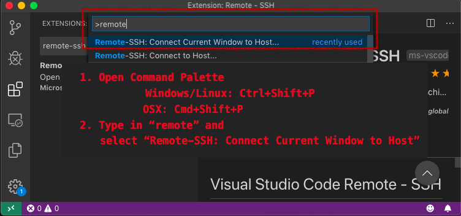
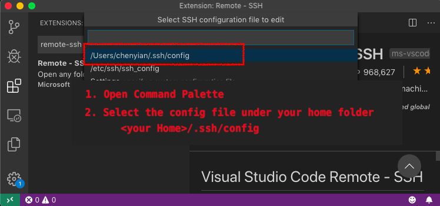
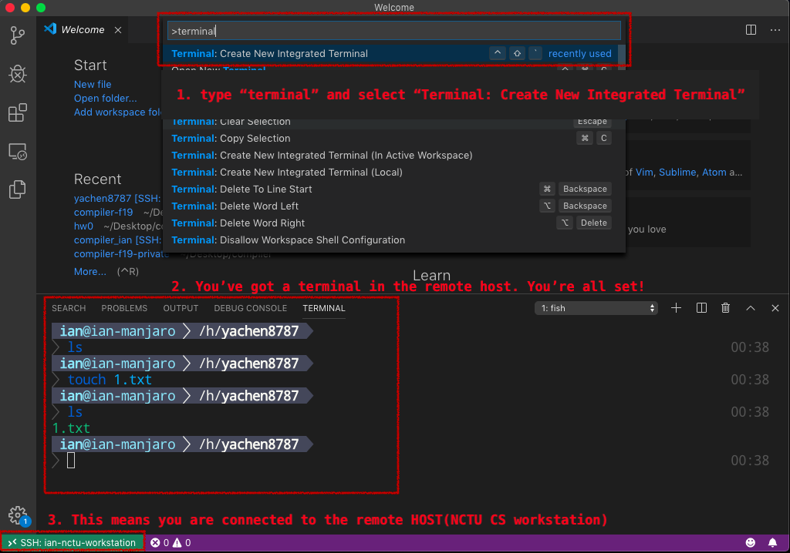

# 遠端編輯

> 基本上這裡寫的文件目的只在我們的環境下走過一次 [#Visual Studio Code 使用 Remote - SSH 開啟遠端 Linux 資料夾](https://footmark.info/software/editor/vscode-remote-ssh-linux-folder/) 的教學，同學可以兩邊一起參考。


### Outline

+ [SSH key login](#ssh-key-login)
    + [Hands on](#hands-on)
+ [VSCode](#vscode)
    + [Hands on](#hands-on-1)

### SSH key login

SSH 有種稱為 **公開金鑰認證** 的登入方式。 這種方式是建立在`非對稱式加密`( asymmetrical encryption )上 。簡單來說，我們可以透過演算法產生一對公鑰（public key）與私鑰（secret key）。一段透過公鑰加密的文字，在這個世界上唯有當初對應的私鑰才能解密。

 我們會先透過 `ssh-keygen` 產生出上述提到的那一對鑰匙，並將其中的公鑰複製到想登入的遠端的帳戶中（放在目標使用者的 `~/.ssh/authorized_keys` 檔案裏 ）。
 
 嘗試登入時，遠端主機會先構思出一個秘密字串，並透過我們給的公鑰來加密、傳遞給使用者，本地端電腦會用私鑰解密回遠端的秘密字串並回傳給伺服器進行比對。由於私鑰是只有你擁有的，一但遠端確認你回傳的字串跟主機上的相同，就能確認這台電腦的身份，你也能憑此自由登入。

> 上述提到的認證原理中，使用者只要確保公私鑰放置的位置正確，並不要洩露出私鑰就好。

如果同學對 SSH 加密認證的資訊有興趣，可以到 [#這裏](https://www.digitalocean.com/community/tutorials/understanding-the-ssh-encryption-and-connection-process) 找到更多資訊。

#####  Hands On

Windows 用戶請安裝 OpenSSH 工具並參考 [#這裏](https://zhuanlan.zhihu.com/p/68577071) 來進行安裝。

+ ssh-keygen
    + MAC (OSX): 
        10.12 版本以後已經預載這個工具，可以先下 `which ssh-keygen` 確認自己有沒有安裝，如果沒有可以先 [安裝Homebrew](https://brew.sh/index_zh-tw) 並使用 `brew install ssh-keygen`。

```
mkdir $HOME/.ssh
chmod 700 $HOME/.ssh
ssh-keygen -t rsa
```
這裏可以直接按兩次空白鍵跳過密碼設定，如果你有設定密碼的話，每次你電腦使用這個私鑰時都會需要你輸入密碼。


我們把生產好的本地端金鑰放置到遠端帳戶的 `~/.ssh/.authorized_keys` 檔案中。這裏使用 OpenSSH 中的 `ssh-copy-id` 工具來輔助工作。

```Shell
$ ssh-copy-id -i ~/.ssh/id_rsa.pub <user>@linux1.cs.nctu.edu.tw
```
好了之後可以使用 ssh 來登入看看系計中帳號，看是否能不用密碼登入。
```Shell
ssh <user id>@linux1.cs.nctu.edu.tw
```


# VSCode

### 介紹

VSCode 是微軟近年來為了扭轉公司形象的戰略性產品，在愛用編輯器評比中已能穩定進入前三名。參考到它的遠端編輯功能插件已相當完善，以及原生整合 Git 的特色，在這裡推薦大家嘗試看看，或許這學期之後你除了 Notepad++ 外又多了個愛用的編輯器呢!

更多有關VSCode的奇聞軼事，可以參考[這集](https://teahour.fm/91)採訪第一線開發人員的 podcast，讓你對背後的技術團隊有更深了解。

<a href="https://code.visualstudio.com/"></a>

### Hands On

### Step 0. 安裝 VSCode : [#點我](https://code.visualstudio.com/)

### Step 1. 安裝 Remote SSH 套件

打開 VSCode，點擊左方的套件圖標(Extension, 小積木圖案)，並在搜尋欄中輸入 remote-ssh，找到並安裝第一個看到的套件。


### Step 2. 使用 Remote-SSH

打開 Command Palette (不同作業系統熱鍵不同)
+ Windows / Linux 熱鍵: `Ctrl+Shift+P`
+ OSX 熱鍵: `Command+Shift+P`
 
輸入 `remote-SSH: Connect Current Window to Host`(會自動補全，上下鍵跟Enter選取)



### Step 3. 選擇 ssh remote host

VSCode會讀取你家目錄下的 .ssh/config檔案內容，目前你的電腦應該沒有東西，選擇`Configure SSH Hosts` 來進行設定。


### Step 4. 設定遠端伺服器資訊-1

選擇在你家目錄下的設定檔案 : `<your home>`/.ssh/config



### Step 5. 設定遠端伺服器資訊-2

根據內容輸入資訊，預設應該是不會出現 Port 選項。
打完之後記得進行存擋。

+ Windows/ Linux : `Ctrl + s`
+ OSX: `Command + s`


### Step 6. 連上工作站

重新打開 Command Palette 並輸入 `remote-SSH: Connect Current Window to Host`
選擇你剛剛寫的遠端 （對應到剛剛的 Host 欄位），按下 `Enter` 鍵後應該會直接登入，因為最開始有設定 ssh，但如果你看到VSCode 跳出一個小視窗要求你輸入密碼，那代表你可能沒有設定好 ssh。


### Step 7. 在遠端 瀏覽檔案/打開終端機
